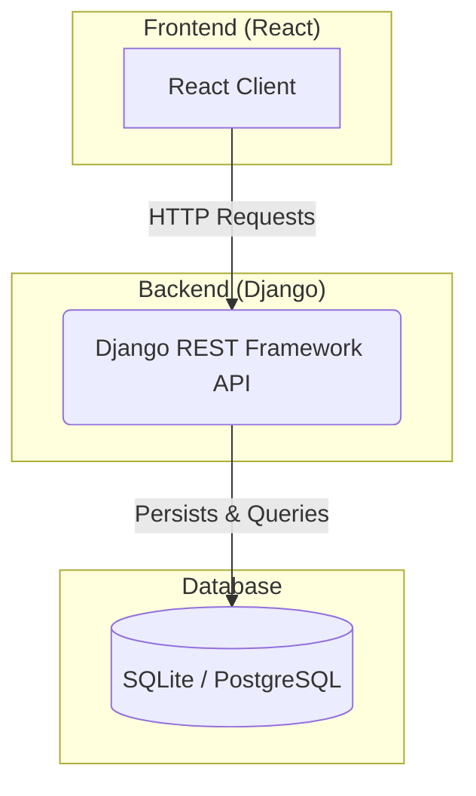

# 🪴 Flourish - A Full-Stack Garden Planning App

Flourish is a comprehensive, full-stack web application designed to help users plan, organize, and improve their gardens. By integrating a Django backend with a React frontend, this application provides a seamless user experience for managing every aspect of a personal garden, from soil analysis to vegetable selection and layout design.

## 🎯 Project Goal

The primary goal of Flourish is to simplify the complex process of garden planning. It provides users with essential tools and information, such as companion planting data, soil recommendations, and a visual layout planner, to help them create a thriving and productive garden year after year.

## ✨ Core Features

* **User Authentication:** Secure user registration and login system to manage personal garden profiles.
* **Garden Management:** Users can create, update, and delete multiple gardens, each with its own specific details.
* **Soil Analysis:** Integrates with a soil data ESRI GIS API to provide users with detailed information and recommendations based on their location.
* **Vegetable Database:** A comprehensive database of vegetables with information on sun exposure, seasonality, and companion/adversary plants.
* **Companion Planting Guide:** Helps users select and arrange plants for a healthier, more productive garden.
* **Visual Garden Layout:** A canvas-based tool for users to sketch and save a physical layout of their garden beds and plants.
* **Personalized Garden Summary:** Generates a detailed report of the user's garden plan, which can be viewed and printed.

## 🏛️ Full Project Architecture

This application is a full-stack project with a distinct frontend and backend. The Django backend serves the React frontend and provides a RESTful API for all data operations.



## 💻 Technology Stack

* **Backend:** Django, Django REST Framework
* **Frontend:** React
* **Database:** SQLite (development), adaptable for PostgreSQL (production)
* **Authentication:** Django Allauth, Django REST Auth

## 📂 Project Structure

The project is organized into several Django apps, with the `frontend` app serving the compiled React build.

* **`accounts`:** Manages user registration, login, and profiles.
* **`gardens`:** Contains the models and views for gardens, vegetables, and soil data.
* **`api`:** The central hub for all API endpoints.
* **`frontend/static`:** The root directory for the React application, including all components, static assets, and the final build.

## 🚀 Local Setup & Installation

### Prerequisites

* Python 3.9+
* Node.js and npm
* Pipenv

### Backend Setup (Django)

1.  **Clone the Repository:**
    ```bash
    git clone <your-repository-url>
    cd django-react-garden-app
    ```

2.  **Install Dependencies:**
    ```bash
    pipenv install
    pipenv shell
    ```

3.  **Apply Database Migrations:**
    ```bash
    python manage.py migrate
    ```

4.  **Run the Backend Server:**
    ```bash
    python manage.py runserver
    ```
    The Django server will start on `http://127.0.0.1:8000`.

### Frontend Setup (React)

1.  **Navigate to the Frontend Directory:**
    ```bash
    cd frontend/static
    ```

2.  **Install Dependencies:**
    ```bash
    npm install
    ```

3.  **Run the Development Server:**
    ```bash
    npm start
    ```
    The React development server will start on `http://localhost:3000`.

## 📜 Available Scripts

In the `frontend/static` directory, you can run:

* `npm start`: Runs the app in development mode.
* `npm run build`: Builds the app for production to the `build` folder.
* `npm test`: Launches the test runner.

